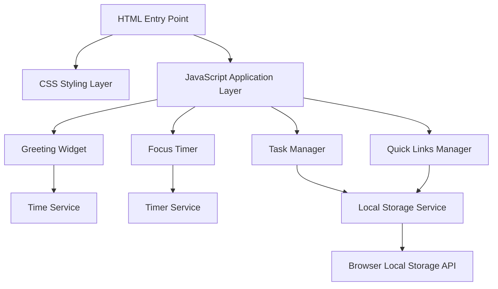

# Design Document: Productivity Dashboard

## Overview

The Productivity Dashboard is a client-side web application that provides essential productivity tools in a unified interface. The application consists of four main components: a greeting widget with time/date display, a 25-minute focus timer, a task management system, and quick links to favorite websites. All data persistence is handled through the browser's Local Storage API, eliminating the need for backend infrastructure.

The application follows a component-based architecture where each widget operates independently while sharing common styling and layout principles. The design prioritizes simplicity, performance, and user experience with a clean single-page layout that requires no scrolling on standard desktop resolutions.

## Architecture

### System Architecture

The application follows a modular client-side architecture with clear separation of concerns:



### Component Architecture

Each component is designed as a self-contained module with the following structure:

- **State Management**: Internal state handling with Local Storage persistence
- **Event Handling**: User interaction processing and DOM event management
- **Rendering**: Dynamic DOM updates and visual state changes
- **Validation**: Input validation and error handling

### Data Flow

1. **Initialization**: Components load saved data from Local Storage on page load
2. **User Interaction**: Events trigger state changes within components
3. **State Updates**: Components update their internal state and DOM representation
4. **Persistence**: State changes are automatically saved to Local Storage
5. **Real-time Updates**: Time-based components update continuously via intervals

## Components and Interfaces

### Greeting Widget Component

**Purpose**: Displays current time, date, and time-based greeting

**Interface**:
```javascript
class GreetingWidget {
  constructor(containerElement)
  init()
  updateTime()
  getTimeBasedGreeting()
  formatTime(date)
  formatDate(date)
}
```

**Responsibilities**:
- Real-time clock display with 12-hour format
- Date display with day of week, month, and day
- Time-based greeting calculation (Morning/Afternoon/Evening/Night)
- Automatic updates every minute via setInterval

### Focus Timer Component

**Purpose**: Provides 25-minute countdown timer for focused work sessions

**Interface**:
```javascript
class FocusTimer {
  constructor(containerElement)
  init()
  start()
  stop()
  reset()
  updateDisplay()
  onTimerComplete()
}
```

**State Properties**:
- `duration`: Timer duration in seconds (default: 1500 for 25 minutes)
- `remainingTime`: Current countdown value in seconds
- `isRunning`: Boolean indicating timer state
- `intervalId`: Reference to setInterval for cleanup

**Responsibilities**:
- 25-minute countdown functionality
- Start, stop, and reset controls
- Real-time display updates every second
- Completion notification when timer reaches zero

### Task Manager Component

**Purpose**: Manages CRUD operations for user tasks with Local Storage persistence

**Interface**:
```javascript
class TaskManager {
  constructor(containerElement)
  init()
  loadTasks()
  saveTasks()
  addTask(text)
  editTask(id, newText)
  toggleTaskComplete(id)
  deleteTask(id)
  renderTasks()
  generateTaskId()
}
```

**State Properties**:
- `tasks`: Array of task objects
- `nextId`: Counter for generating unique task IDs

**Task Data Structure**:
```javascript
{
  id: string,
  text: string,
  completed: boolean,
  createdAt: timestamp
}
```

**Responsibilities**:
- Task creation with validation (non-empty text)
- Task editing with inline text editing
- Task completion status toggling
- Task deletion with confirmation
- Local Storage persistence for all operations
- Maintaining task order across sessions

### Quick Links Manager Component

**Purpose**: Manages user-defined website shortcuts with Local Storage persistence

**Interface**:
```javascript
class QuickLinksManager {
  constructor(containerElement)
  init()
  loadLinks()
  saveLinks()
  addLink(url, displayName)
  deleteLink(id)
  openLink(url)
  renderLinks()
  validateUrl(url)
  generateLinkId()
}
```

**State Properties**:
- `links`: Array of link objects
- `nextId`: Counter for generating unique link IDs

**Link Data Structure**:
```javascript
{
  id: string,
  url: string,
  displayName: string,
  createdAt: timestamp
}
```

**Responsibilities**:
- Link creation with URL and display name validation
- Link deletion functionality
- Opening links in new browser tabs
- Local Storage persistence
- URL validation to ensure proper format

### Local Storage Service

**Purpose**: Centralized data persistence layer

**Interface**:
```javascript
class LocalStorageService {
  static save(key, data)
  static load(key)
  static remove(key)
  static clear()
}
```

**Storage Keys**:
- `productivity-dashboard-tasks`: Task list data
- `productivity-dashboard-links`: Quick links data

**Responsibilities**:
- JSON serialization/deserialization
- Error handling for storage operations
- Data validation on load operations

## Data Models

### Task Model

```javascript
class Task {
  constructor(text) {
    this.id = generateUniqueId()
    this.text = text
    this.completed = false
    this.createdAt = new Date().toISOString()
  }
  
  validate() {
    return this.text && this.text.trim().length > 0
  }
  
  toggle() {
    this.completed = !this.completed
  }
  
  updateText(newText) {
    if (newText && newText.trim().length > 0) {
      this.text = newText.trim()
      return true
    }
    return false
  }
}
```

### Link Model

```javascript
class Link {
  constructor(url, displayName) {
    this.id = generateUniqueId()
    this.url = url
    this.displayName = displayName
    this.createdAt = new Date().toISOString()
  }
  
  validate() {
    return this.url && this.url.trim().length > 0 && 
           this.displayName && this.displayName.trim().length > 0 &&
           this.isValidUrl(this.url)
  }
  
  isValidUrl(string) {
    try {
      new URL(string)
      return true
    } catch (_) {
      return false
    }
  }
}
```

### Application State Model

```javascript
class AppState {
  constructor() {
    this.tasks = []
    this.links = []
    this.timerState = {
      duration: 1500, // 25 minutes in seconds
      remainingTime: 1500,
      isRunning: false
    }
  }
  
  serialize() {
    return {
      tasks: this.tasks,
      links: this.links
    }
  }
  
  deserialize(data) {
    this.tasks = data.tasks || []
    this.links = data.links || []
  }
}
```

### Time and Date Utilities

```javascript
class TimeUtils {
  static getCurrentTime() {
    return new Date()
  }
  
  static formatTime12Hour(date) {
    return date.toLocaleTimeString('en-US', {
      hour: 'numeric',
      minute: '2-digit',
      hour12: true
    })
  }
  
  static formatDate(date) {
    return date.toLocaleDateString('en-US', {
      weekday: 'long',
      month: 'long',
      day: 'numeric'
    })
  }
  
  static getTimeBasedGreeting(date) {
    const hour = date.getHours()
    if (hour >= 5 && hour < 12) return "Good Morning"
    if (hour >= 12 && hour < 17) return "Good Afternoon"
    if (hour >= 17 && hour < 21) return "Good Evening"
    return "Good Night"
  }
}
```

## Correctness Properties

*A property is a characteristic or behavior that should hold true across all valid executions of a system-essentially, a formal statement about what the system should do. Properties serve as the bridge between human-readable specifications and machine-verifiable correctness guarantees.*

### Property 1: Time Format Consistency

*For any* date and time, the greeting widget's time formatting function should always produce a 12-hour format string containing AM or PM indicator.

**Validates: Requirements 1.1**

### Property 2: Date Format Completeness

*For any* date, the greeting widget's date formatting function should always include day of week, month name, and day number.

**Validates: Requirements 1.2**

### Property 3: Time-Based Greeting Accuracy

*For any* time of day, the greeting function should return "Good Morning" for 5:00-11:59 AM, "Good Afternoon" for 12:00-4:59 PM, "Good Evening" for 5:00-8:59 PM, and "Good Night" for 9:00 PM-4:59 AM.

**Validates: Requirements 2.1, 2.2, 2.3, 2.4**

### Property 4: Timer State Transitions

*For any* timer state, starting should set isRunning to true, stopping should preserve remaining time while setting isRunning to false, and resetting should restore original duration regardless of current state.

**Validates: Requirements 3.2, 3.3, 3.4**

### Property 5: Timer Countdown Behavior

*For any* running timer, the remaining time should decrease by 1 second for each second that passes until it reaches zero.

**Validates: Requirements 3.6**

### Property 6: Task Creation and Storage

*For any* valid (non-empty) task text, creating a task should result in a new task object that can be retrieved from storage with the same text content.

**Validates: Requirements 4.1, 4.2**

### Property 7: Unique Task Identification

*For any* sequence of task creation operations, all generated task IDs should be unique within the task list.

**Validates: Requirements 4.3**

### Property 8: Input Validation Rejection

*For any* empty string or whitespace-only string, task creation and link creation should reject the input and leave the respective lists unchanged.

**Validates: Requirements 4.4, 9.3**

### Property 9: Task Edit Preservation

*For any* task in edit mode, canceling the edit should preserve the original task text exactly as it was before editing began.

**Validates: Requirements 5.4**

### Property 10: Task State Persistence

*For any* task operation (create, edit, toggle completion, delete), the resulting state should be immediately saved to and retrievable from Local Storage.

**Validates: Requirements 4.2, 5.3, 6.2, 7.2**

### Property 11: Task Completion Toggle

*For any* task, toggling completion status should change the completed flag from false to true or true to false, and this change should be reflected in both the UI styling and stored data.

**Validates: Requirements 6.1, 6.3, 6.4**

### Property 12: Task Deletion Completeness

*For any* task that exists in the task list, deleting it should remove all traces of the task from both the UI display and Local Storage.

**Validates: Requirements 7.1, 7.2, 7.3**

### Property 13: Data Persistence Round Trip

*For any* collection of tasks and links, saving to Local Storage and then loading should produce an equivalent collection with the same content and order.

**Validates: Requirements 8.1, 8.4, 10.3**

### Property 14: Link Creation and Storage

*For any* valid URL and display name pair, creating a link should result in a new link object that can be retrieved from storage with the same URL and display name.

**Validates: Requirements 9.1, 9.2**

### Property 15: Link Opening Behavior

*For any* saved link, clicking it should trigger opening the associated URL in a new browser tab.

**Validates: Requirements 10.1**

## Error Handling

### Input Validation Errors

**Task Text Validation**:
- Empty strings and whitespace-only strings are rejected
- Maximum length limits prevent storage overflow
- Special characters are properly escaped for display

**URL Validation**:
- Invalid URL formats are rejected using URL constructor validation
- Protocol requirements (http/https) are enforced
- Malformed URLs display user-friendly error messages

**Display Name Validation**:
- Empty display names are rejected
- Maximum length limits prevent UI layout issues
- Special characters are properly escaped

### Storage Operation Errors

**Local Storage Failures**:
- Storage quota exceeded errors are caught and reported
- Corrupted data is detected and handled gracefully
- Missing storage keys default to empty collections

**Data Serialization Errors**:
- JSON parsing errors are caught and logged
- Invalid data structures are rejected with fallback to defaults
- Version compatibility is maintained for future updates

### Timer Operation Errors

**Timer State Errors**:
- Invalid timer states are reset to default values
- Negative time values are corrected to zero
- Timer completion handles edge cases gracefully

### UI Interaction Errors

**DOM Manipulation Errors**:
- Missing DOM elements are detected and recreated
- Event listener failures are caught and re-attached
- Dynamic content updates handle missing containers

**User Input Errors**:
- Form submission errors display clear feedback
- Invalid interactions are prevented with UI state management
- Accessibility errors are handled with proper ARIA attributes

## Testing Strategy

### Dual Testing Approach

The testing strategy employs both unit testing and property-based testing to ensure comprehensive coverage:

**Unit Tests**: Focus on specific examples, edge cases, and integration points between components. Unit tests verify concrete scenarios and error conditions that are difficult to generate randomly.

**Property Tests**: Verify universal properties across all possible inputs using randomized test data. Property tests ensure that the system behaves correctly for the full range of valid inputs, not just predetermined test cases.

### Unit Testing Focus Areas

**Specific Examples**:
- Timer initialization with 25-minute default duration
- Empty task list display when no tasks are stored
- Specific time-based greeting examples (e.g., 10:30 AM → "Good Morning")
- Font size validation (minimum 14px for body text)
- Single-page layout validation on standard desktop resolutions

**Edge Cases**:
- Timer completion at exactly zero seconds
- Maximum task list size (100 tasks)
- Maximum quick links size (20 links)
- Browser storage quota limits
- Invalid URL formats and malformed input

**Integration Points**:
- Component initialization and DOM attachment
- Local Storage service integration
- Event handler attachment and cleanup
- Cross-component state synchronization

### Property-Based Testing Configuration

**Testing Library**: Use fast-check for JavaScript property-based testing
**Test Configuration**: Minimum 100 iterations per property test
**Test Tagging**: Each property test references its design document property

**Property Test Examples**:

```javascript
// Property 3: Time-Based Greeting Accuracy
// Feature: productivity-dashboard, Property 3: Time-based greeting accuracy
fc.assert(fc.property(
  fc.integer(0, 23), // hour
  fc.integer(0, 59), // minute
  (hour, minute) => {
    const testDate = new Date(2024, 0, 1, hour, minute)
    const greeting = getTimeBasedGreeting(testDate)
    
    if (hour >= 5 && hour < 12) return greeting === "Good Morning"
    if (hour >= 12 && hour < 17) return greeting === "Good Afternoon"
    if (hour >= 17 && hour < 21) return greeting === "Good Evening"
    return greeting === "Good Night"
  }
), { numRuns: 100 })

// Property 6: Task Creation and Storage
// Feature: productivity-dashboard, Property 6: Task creation and storage
fc.assert(fc.property(
  fc.string(1, 100).filter(s => s.trim().length > 0), // valid task text
  (taskText) => {
    const taskManager = new TaskManager()
    const taskId = taskManager.addTask(taskText)
    const retrievedTask = taskManager.getTask(taskId)
    
    return retrievedTask && retrievedTask.text === taskText.trim()
  }
), { numRuns: 100 })
```

### Test Coverage Requirements

**Component Coverage**: Each component must have both unit and property tests
**Requirement Coverage**: Every testable acceptance criterion must have corresponding tests
**Error Path Coverage**: All error handling paths must be tested
**Browser Compatibility**: Manual testing across specified browser versions
**Performance Validation**: Load testing with maximum data limits (100 tasks, 20 links)

### Continuous Testing

**Development Testing**: Tests run automatically on code changes
**Integration Testing**: Full application testing in browser environment
**Regression Testing**: Existing functionality verification after changes
**Accessibility Testing**: Manual validation of ARIA attributes and keyboard navigation